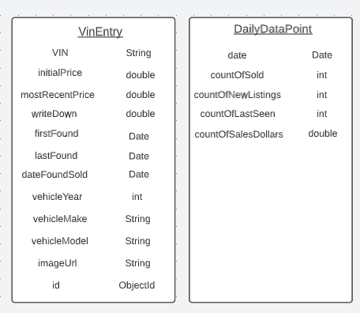

<h1>Carvana Tracker</h1>

An application for tracking Carvana's inventory via their front-end customer API.

# Notes

<li>Exposes API for getting the latest data on sales, incoming inventory, and existing inventory.</li>
<li>Exposes API for estimating sales for the current quarter.</li>
<li>Stores data for each individual VIN in MongoDB Repository</li>
<li>Scheduled task to maintain daily data counts to be queried.</li>
<li>Multi-threaded executors for querying Carvana's API.</li>
<li>Tracking write-downs of existing inventory.</li>
<li>Configured for Eureka Naming Server</li>

# Schema

  
